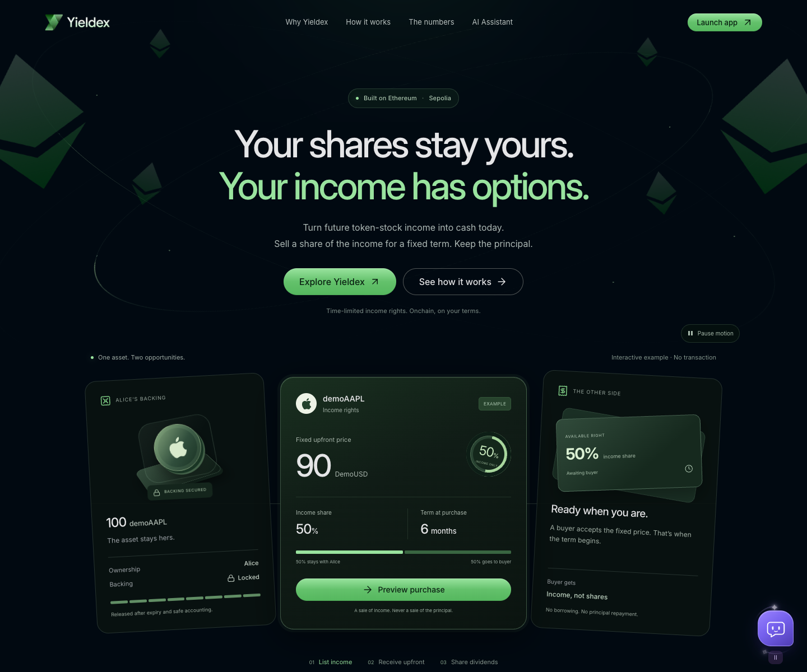
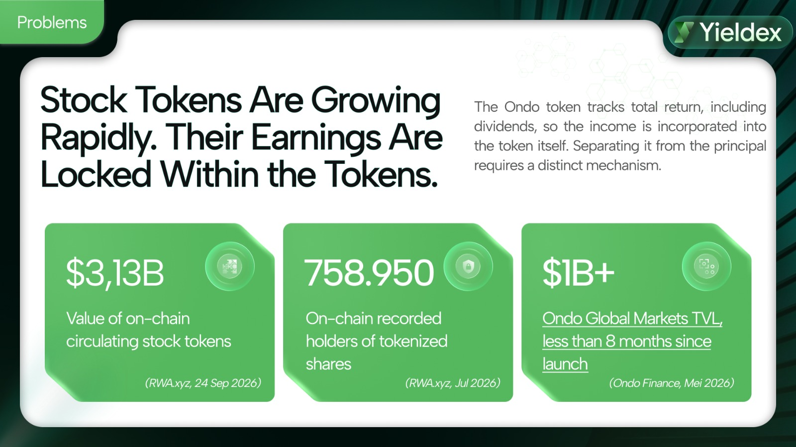
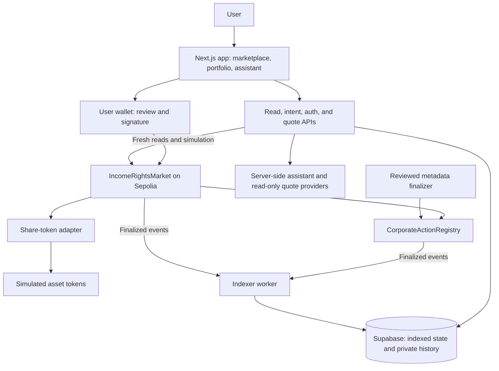

<p align="center">
  
</p>

<h1 align="center">Trade the income. Keep the principal rights.</h1>

<p align="center">
  A marketplace where tokenized asset holders unlock upfront liquidity by selling income rights<br />
  for a fixed period while retaining ownership of the underlying assets.<br />
  Built for Ethereum Jakarta 2026.
</p>

<p align="center">
  
  
  
  
  
</p>

<p align="center">
  <a href="https://yieldex-rwa.vercel.app"><strong>Live Demo</strong></a> ·
  <a href="#how-it-works">How It Works</a> ·
  <a href="#architecture">Architecture</a> ·
  <a href="#deployed-contracts">Contracts</a> ·
  <a href="#getting-started">Getting Started</a> ·
  <a href="#verification">Verification</a>
</p>

> **Hackathon prototype · Sepolia only.** Transactions use simulated assets and DemoUSD. These tokens do not represent real shares, dollar reserves, or guaranteed income. Full browser acceptance is still in progress; see [demo status](#demo-status-and-boundaries).

<p align="center">
  <a href="https://yieldex-rwa.vercel.app">
    
  </a>
</p>
<p align="center"><sub>Live landing page · 10 October 2026 · The cards shown are an illustrative example.</sub></p>

## The Problem

Tokenization brings assets on-chain, but income is not always a separate cash flow that holders can sell. Some tokenized stocks reinvest dividends into the asset's value. Accessing that value independently of the principal requires a separate mechanism.

<p align="center">
  <a href="./docs/images/yieldex-problem.jpg">
    
  </a>
</p>

_Team pitch slide. Figures retain the source dates printed in the image; they are not live market metrics._

For example, [Ondo describes its tokenized stocks as total-return trackers](https://ondo.finance/ondo-stocks), with dividends reinvested rather than paid as a separate claim. This is market context, not an Ondo integration: Yieldex currently demonstrates income-rights accounting with simulated tokens on Sepolia.

<details>
<summary>Sources and dates behind the slide</summary>

- **Market size and holders:** the slide attributes $3.13B to 24 September 2026 and 758,950 holders to July 2026 on [RWA.xyz](https://app.rwa.xyz/stocks). The exact historical snapshots have not been independently reproduced; the dashboard changes over time, and on-chain holder counts should not be treated as unique people.
- **Ondo milestone:** its [11 May 2026 announcement](https://ondo.finance/blog/ondo-tokenized-stocks-surpass-one-billion-tvl) confirms $1B in TVL in under eight months. This is a dated milestone, not a current balance.

</details>

## The Yieldex Approach

An asset holder may want cash today while retaining the right to recover their underlying tokens. A buyer may want exposure to the income those tokens generate for a specific period, without buying the principal.

Yieldex separates those two rights. A seller locks backing tokens in a smart contract and lists a percentage of their income for a fixed price and term. A buyer pays upfront and receives the specified income rights. The seller retains the principal rights, while the backing stays locked until it can be safely released.

The buyer can later resell the **entire remaining position**. Its original expiry stays fixed, and income already allocated to a previous owner remains theirs to claim.

### A concrete example

1. **Alice lists:** she locks 100 demoAAPL and offers 50% of eligible income for 30 days at a price she chooses in DemoUSD.
2. **Bob buys:** his payment goes to Alice. The 30-day term starts at purchase, and Bob becomes the income-rights owner.
3. **Income is allocated:** if a supported dividend event occurs during the term and is finalized, Alice and Bob receive their respective shares. Claims are paid in demoAAPL, not DemoUSD.
4. **Bob resells:** Carol buys the remaining position. Bob keeps his already allocated claims; Carol receives the rights for the rest of the original term.
5. **The term ends:** after accounting and event coverage are complete, Alice can release the remaining principal backing. Outstanding claims stay reserved for their recipients.

This example is hypothetical. Income can be zero, and the buyer's purchase price is **not refunded at expiry**. Stock splits change token quantities; they are not counted as dividends.

## How It Works

| Step         | What the user does                                                      | What the protocol enforces                                                                 |
| ------------ | ----------------------------------------------------------------------- | ------------------------------------------------------------------------------------------ |
| **Discover** | Browse listings or ask the assistant to compare them                    | Asset, price, income percentage, duration, and data freshness come from canonical services |
| **Create**   | Choose backing, income share, price, and term; review and sign          | Backing is locked when the primary listing is created                                      |
| **Purchase** | Approve the payment amount if needed, then review and sign the purchase | Payment and rights activation happen atomically; approval alone is not a purchase          |
| **Claim**    | Withdraw allocated income from the portfolio                            | Claims are recorded in token shares and paid in the underlying asset                       |
| **Resell**   | List the whole active position for its remaining term                   | Ownership changes without resetting expiry or transferring past claims                     |
| **Settle**   | Complete accounting and release eligible principal                      | Release requires event coverage and preserves outstanding claim reserves                   |

Positions live in an on-chain ledger. There is no NFT mint, partial resale, or direct gifting of positions.

## The AI Assistant

The assistant helps users understand and navigate the marketplace:

- **Discover and compare** listings using their actual terms and availability.
- **Explain a position** and prepare a purchase preview for explicit user review.
- **Compare token quotes** using read-only provider data, with chain, amount, fees, and freshness shown.

The model does not hold signing keys or construct arbitrary transaction calldata. Shared application code builds and validates transaction intents; the user reviews them and authorizes execution through their wallet.

Quote comparisons use mainnet market data and are separate from the Sepolia marketplace. They do not execute swaps or bridges, and a quote is not a way to convert DemoUSD into real tokens. See [assistant integration](docs/chatbot-live-integration.md) and [quote semantics](docs/spec/ai-and-quotes.md).

## Architecture



**The chain is authoritative for backing, ownership, payments, and claims.** Supabase provides searchable projections and private history. The app revalidates transaction terms against current chain state before a wallet action; the assistant's prose and cached listings do not authorize a purchase.

Corporate-action metadata is finalized by a constrained team-operated role for this hackathon. Its classification and completeness are a trust assumption. This role cannot choose arbitrary payout recipients or withdraw backing, but missing or ambiguous metadata can delay settlement and principal release.

### Smart contract responsibilities

| Component                                                                       | Responsibility                                                                                                     |
| ------------------------------------------------------------------------------- | ------------------------------------------------------------------------------------------------------------------ |
| [`IncomeRightsMarket`](packages/contracts/src/IncomeRightsMarket.sol)           | Backing custody, primary sales, whole-position resale, share accounting, claims, settlement, and principal release |
| [`CorporateActionRegistry`](packages/contracts/src/CorporateActionRegistry.sol) | Asset configuration, ordered finalized events, coverage, and quarantine controls                                   |
| [`Adapters`](packages/contracts/src/adapters)                                   | Interpret supported token shares and multipliers; splits are distinguished from income                             |
| [`Demo tokens`](packages/contracts/src/mocks)                                   | Simulate asset behavior and payment tokens for reproducible testnet demonstrations                                 |
| [`Shared package`](packages/shared)                                             | One set of generated types, schemas, ABIs, deployment configuration, and deterministic transaction preparation     |

Financial quantities use integer arithmetic. API money and large IDs are decimal strings. See [accounting and finality](docs/spec/accounting-and-finality.md) for allocation rules, rounding, event boundaries, and reserve conservation.

## Deployed Contracts

**Network:** Ethereum Sepolia · **Chain ID:** `11155111` · **Payment token:** DemoUSD, 6 decimals.

| Contract                | Address                                                                                                                         |
| ----------------------- | ------------------------------------------------------------------------------------------------------------------------------- |
| IncomeRightsMarket      | [`0x25e2288d8fa689a1d9895a31b26130153f2dc76f`](https://sepolia.etherscan.io/address/0x25e2288d8fa689a1d9895a31b26130153f2dc76f) |
| CorporateActionRegistry | [`0x1dc400d88dd48bfd1dbb2687453e0e23dac77fa5`](https://sepolia.etherscan.io/address/0x1dc400d88dd48bfd1dbb2687453e0e23dac77fa5) |
| DemoUSD                 | [`0x510e5e7ea5235fa2a1480a84c15e64873081b378`](https://sepolia.etherscan.io/address/0x510e5e7ea5235fa2a1480a84c15e64873081b378) |

The demo supports **demoSPY, demoAAPL, and demoMSFT**. All asset and adapter addresses, the deployment block, and the contract source revision are in the [Sepolia manifest](deployments/sepolia.json).

Creation and runtime matches for the seven deployed contracts are recorded in the [hosted rollout evidence](docs/hosted-rollout.md). Inspect the [market source on Sourcify](https://repo.sourcify.dev/11155111/0x25e2288d8fa689a1d9895a31b26130153f2dc76f). Explorer links above identify addresses; source verification is not a security audit.

## Demo Status and Boundaries

| Area                         | Current scope                                                                                                                                         |
| ---------------------------- | ----------------------------------------------------------------------------------------------------------------------------------------------------- |
| Marketplace and portfolio    | Product routes for discovery, listing review, creation, positions, and claims are implemented; complete wallet/browser acceptance remains in progress |
| Sepolia core lifecycle       | Script-driven create, buy, dividend allocation, resale, split, expiry, claims, and release were verified with actual receipts and balances            |
| Assistant                    | Discovery, explanation, quote cards, and wallet handoff are implemented; provider configuration and hosted verification are separate requirements     |
| Official-token compatibility | Pinned Ethereum fork tests are recorded separately from the simulated Sepolia assets; this is not a live real-stock integration                       |
| Production readiness         | Hackathon prototype; no claim of a completed independent security audit or readiness for real funds                                                   |

**Wallet security notice — 10 October 2026:** MetaMask's domain scanner returned `BLOCK` with a `DRAINER` classification for the demo domain. The evidence behind that classification and whether it is a false positive remain unresolved. Do not bypass wallet security alerts to try the demo. [Scanner response](https://dapp-scanning.api.cx.metamask.io/scan?url=yieldex-rwa.vercel.app) · [MetaMask guidance](https://support.metamask.io/configure/wallet/security-alerts/).

Use a separate test wallet with Sepolia ETH and team-provided demo tokens for an approved test session. DemoUSD has no dollar backing. There is no public faucet promised by this repository, guaranteed yield, automatic swap, or bridge. Token prices, issuer behavior, and metadata availability remain separate risks.

## Tech Stack

| Layer                   | Technology                                                              |
| ----------------------- | ----------------------------------------------------------------------- |
| Web application         | Next.js 16, React 19, TypeScript, Tailwind CSS, GSAP                    |
| Wallet and chain access | viem, EVM browser wallet, Ethereum Sepolia                              |
| Contracts               | Solidity 0.8.34, OpenZeppelin, Foundry / Anvil 1.7.1                    |
| Assistant               | CopilotKit, server-side OpenAI integration, validated tool-result cards |
| Read-only quotes        | 0x provider adapter                                                     |
| Data and identity       | Supabase PostgreSQL, Web3 authentication, row-level security            |
| Background processing   | TypeScript finalized-log indexer and reviewed finalizer                 |
| Tooling                 | pnpm workspaces, Vitest, ESLint, Prettier, OpenSpec 1.3.1               |
| Hosting                 | Vercel web/API, separate indexer service, hosted Supabase               |

Versions are pinned in the workspace manifests and lockfile.

## Getting Started

### 1. Install the pinned toolchain

Use **Node.js 24.18.0**, **pnpm 11.3.0**, **Python 3.12+**, and [uv](https://docs.astral.sh/uv/getting-started/installation/). Forge and Anvil are installed as local workspace dependencies.

```sh
git clone https://github.com/wildanniam/yieldex-rwa.git
cd yieldex-rwa
nvm install
nvm use
corepack pnpm install --frozen-lockfile
corepack pnpm doctor
```

If your Node installation does not include Corepack, install the pinned pnpm version and use `pnpm` directly. See [development setup](docs/development.md) for alternatives.

### 2. Start the web and worker shell

```sh
pnpm dev
```

Open [http://localhost:3000](http://localhost:3000). Worker health is available at [http://127.0.0.1:3101/health](http://127.0.0.1:3101/health).

The landing page and application shell can boot without private credentials. Live market data, authenticated history, AI, and quotes need their respective services and configuration; starting the shell does not start the indexer or create a blockchain deployment.

### 3. Configure the services you need

Copy the environment templates and fill in only the integrations you intend to run:

```sh
cp apps/web/.env.example apps/web/.env.local
cp apps/worker/.env.example apps/worker/.env
```

| Capability                                              | Setup guide                                                                 |
| ------------------------------------------------------- | --------------------------------------------------------------------------- |
| Isolated local chain, database, deployment, and indexer | [Local core runbook](docs/local-core.md) — requires Docker and Supabase CLI |
| Hosted Sepolia deployment and verified database TLS     | [Hosted rollout](docs/hosted-rollout.md)                                    |
| Assistant credentials, sessions, and persistence        | [Chatbot integration](docs/chatbot-live-integration.md)                     |
| Provider-backed token quotes                            | [Local core: live quotes](docs/local-core.md)                               |

For local authentication, use `localhost` and keep `APP_ORIGIN` identical to the browser origin and the provider's allowed origin. Keep signer keys, database credentials, and provider keys out of the browser, source control, and chat prompts.

Useful routes: `/` for the landing page, `/marketplace`, `/dashboard`, `/sell`, `/chat`, and `/wallet` for the product; `/lab`, `/workspace`, and `/design-system` for development tools.

## Verification

Run the repository checks from the root:

```sh
pnpm check
```

This runs formatting, lint, type checks, TypeScript and contract tests, generated-artifact checks, spec validation, and builds.

| Command                 | Scope                                                                            |
| ----------------------- | -------------------------------------------------------------------------------- |
| `pnpm test`             | Application, shared logic, and integration tests using their configured fixtures |
| `pnpm test:contracts`   | Solidity unit, differential, fuzz, and invariant tests                           |
| `pnpm test:local`       | Isolated Anvil lifecycle, indexer, and read API; requires local services         |
| `pnpm test:fork`        | Pinned official-token compatibility; requires an Ethereum RPC                    |
| `pnpm test:quotes:live` | Provider quote reads; requires configuration and does not execute swaps          |
| `pnpm generate:check`   | Shared interface, ABI/type/schema, and team-context drift                        |

A passing local suite does not establish hosted browser behavior. [Core verification](docs/core-verification.md), [hosted evidence](docs/hosted-rollout.md), and [frontend integration](docs/frontend-live-integration.md) record the environment and limitations of each check. The [active acceptance checklist](openspec/changes/build-rwa-income-rights/tasks.md) keeps unfinished gates visible.

## Project Structure

```text
yieldex-rwa/
├── apps/web/             # Product UI, assistant, auth, and HTTP APIs
├── apps/worker/          # Finalized indexer and reviewed metadata finalizer
├── packages/contracts/  # Solidity contracts, adapters, demo tokens, and tests
├── packages/shared/     # Generated types/ABIs, schemas, chain reads, intents
├── deployments/         # Public deployment manifests
├── supabase/            # Migrations and row-level security tests
├── schemas/             # Canonical wire-data definitions
├── examples/            # Valid and deliberately invalid fixtures
├── tests/               # Integration and browser-test support
├── openspec/            # Active requirements, design, and acceptance tasks
└── docs/                # Runbooks, interfaces, and verification evidence
```

## Contributing and Design Notes

Read [CONTRIBUTING.md](CONTRIBUTING.md) before making changes. Work on a task branch, test the affected behavior, and open a PR for review.

- [Product brief](docs/product.md) — user needs and product scope.
- [Active decisions](docs/spec/decisions.md) — accepted economics and trust boundaries.
- [Contract interface](docs/spec/contract-interface.md) — methods, events, errors, and guards.
- [Visual design](DESIGN.md) — the team's UI direction.
- [Source provenance](docs/repository-import.md) — the imported experiment and its verification history.
- [Shared AI context](docs/TEAM-CONTEXT.md) — generated from repository sources; never edit it manually.

Use `pnpm generate` after changing shared specifications or context sources. The baseline OpenSpec change stays active until its implementation and acceptance are complete.

---

<p align="center">
  <strong>Yieldex</strong><br />
  Separate principal rights from income rights. Make the terms visible on-chain.
</p>
